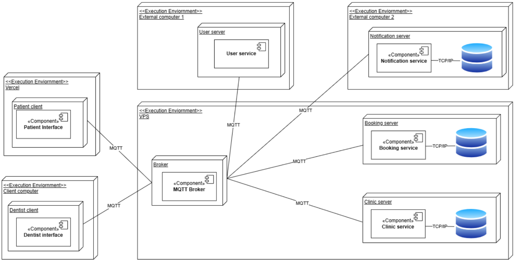
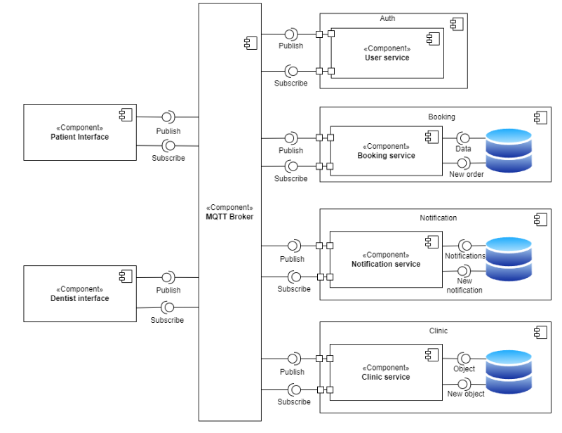

# DENTIGO
## Introduction
This project focuses on creating a distributed system to simplify the process of booking dentist appointments in Gothenburg, with plans to expand across Sweden. The system provides a web-based graphical user interface (GUI) that allows users to search for available appointment slots within specified time windows, view them on an interactive map, and book or cancel appointments. Users are notified about booking updates in real time, ensuring a seamless experience.

The backend is powered by a scalable middleware layer that employs the MQTT protocol for efficient message handling between components. This middleware layer manages the registration and updating of appointment slots and offers APIs for dentists to integrate with their existing IT systems. A separate CLI tool is also included for dentists to manually register available time slots and handle booking notifications during testing and demonstration.

### Standout features
1) Encryption using RSA-OAEP and AES-256-CTR
2) Using BankID API to replicate real-world use

### Personal contribution in the following repos:
1) [Patient Interface](https://github.com/jitishp04/DENTIGO-Patient-Interface)
2) [Clinic Service](https://github.com/jitishp04/DENTIGO-Clinic-Service)

## Technologies
Main language: TypeScript

Frontend: Vue.js, TypeScript, Tailwind CSS, Daisy UI, Node.js CLI

Message Broker: Custom HiveMQ broker 

Database: Postgres 

Testing: Jest, Apache JMeter 

Deployment: Docker, Vercel, Gitlab CI/CD

## System Design
| **Component Diagram** | **Deployment Diagram** |
|-----------------|---------------------------------|
|  |  |

